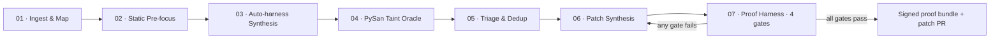

# PRAHARI

**P**roof-carrying **R**easoning **A**nd **H**ardening for **A**utonomous **R**emediation of **I**ntrusions

> An air-gap-deployable cyber-reasoning system that finds, patches, and **proves** — with no human in the loop.

Built for **AI Kavach**, the autonomous cyber-reasoning challenge: an LLM wired to fuzzers, static and
dynamic analysis, and a regression harness that finds a vulnerability, patches it, and proves the fix holds.

---

## Status

**Design stage / pre-prototype.** This repository currently holds the architecture, the proof-bundle
format, the PySan design note, and the submission deck. The working prototype is built during the
36-hour Grand Finale.

Every number in this repository is a **stated target**, not a measured result. Nothing here claims a
benchmark that has been run.

---

## The problem

Autonomous cyber-reasoning works on C and C++ because a **segfault is free ground truth**.
AddressSanitizer tells you, with no ambiguity and at no cost, that you have found a real bug. That single
signal is what makes the whole find → patch → verify loop possible.

Web and API services have no segfault. **An SQL injection returns HTTP 200.**

So on the software that actually runs an organisation's logistics portals, C2 services and internal REST
APIs, the loop breaks in two places at once:

- **Fuzzers are blind.** With no crash oracle, a fuzzer cannot tell a successful exploit from a normal
  response. A 500 might be a bug; a 200 might be a total compromise.
- **Patches are unverifiable.** Without a reproducible proof-of-vulnerability, an LLM's "fix" is an
  assertion. You cannot show it closed anything, and you cannot show it broke nothing.

Bolting an LLM onto a scanner inherits the same blindness — it only rewrites whatever the scanner
already guessed at.

## The approach

PRAHARI supplies the two missing pieces.

### 1. The missing oracle — PySan

A runtime taint sanitizer for Python: the ASan-equivalent for web services.

PySan installs import-time hooks on dangerous sinks (`cursor.execute`, `os.system`, `subprocess.*`,
`pickle.loads`, `eval`, `open`, ORM raw queries, outbound `requests`) and propagates taint from every
request object through the application.

**A tainted value reaching a sink is a deterministic crash**, captured as a replayable PoV artifact
carrying the request, the trace, the sink, and the full taint path.

```
tainted(request.args['q'])  reaches  cursor.execute()   ⇒   PoV, CWE-89
```

That converts silent injection, path traversal, SSRF, unsafe deserialization and broken-authorization
bugs into exactly the kind of signal a fuzzer and a patcher can both work with.

See [`docs/PYSAN.md`](docs/PYSAN.md) for the design, including its known limitations.

### 2. The missing proof — proof-carrying patches

A patch is **never** accepted on model confidence. It must clear four machine-checkable gates:

| Gate | Check |
| --- | --- |
| **G1** | The PoV replays and is now blocked |
| **G2** | The existing test suite is 100% green |
| **G3** | 10,000 benign requests produce identical pre/post responses (differential fuzz) |
| **G4** | No new taint path is introduced by the patch |

Any failure loops back to patch synthesis with the failing gate as evidence, bounded at *K* iterations
before escalating for human review. Output is a **signed proof bundle** plus a patch PR — re-checkable by
a third party who does not trust the system that produced it.

Format: [`docs/proof-bundle.schema.json`](docs/proof-bundle.schema.json).

---

## Pipeline



| # | Stage | Output |
| --- | --- | --- |
| 01 | **Ingest & Map** — tree-sitter AST and call graph; routes lifted from OpenAPI/Swagger, Flask and FastAPI decorators, Django URLconf | attack-surface inventory |
| 02 | **Static Pre-focus** — Semgrep, CodeQL and custom taint rules rank source-to-sink paths; the model reads only ranked slices, never the whole repo | ranked candidate sink paths |
| 03 | **Auto-harness Synthesis** — one fuzz driver per route, seeded from spec examples. No human writes a harness | per-route fuzz drivers + seed corpus |
| 04 | **PySan Taint Oracle** — instrumented execution; tainted value reaching a sink is a deterministic crash | replayable PoV + full taint path |
| 05 | **Triage & Dedup** — cluster by taint-path signature, map to CWE, score by reachability and auth requirement | deduplicated, CWE-tagged, ranked findings |
| 06 | **Patch Synthesis** — N candidate minimal diffs constrained by the taint path, ranked locally; cloud escalation only on local failure | candidate patch diffs |
| 07 | **Proof Harness** — the four gates above | signed proof bundle + patch PR |

Full detail: [`docs/ARCHITECTURE.md`](docs/ARCHITECTURE.md).

---

## Tech stack

| Layer | Components |
| --- | --- |
| **Target** | Flask · FastAPI · Django · Node/Express, containerised |
| **Sensing** | Semgrep · CodeQL · tree-sitter · OpenAPI parser ‖ Atheris · Hypothesis · schemathesis · coverage.py ‖ **PySan** taint runtime |
| **Reasoning** | asyncio orchestrator (explicit state machine) ‖ **Tier-1 local:** Ollama + Qwen2.5-Coder 3B/7B ‖ **Tier-2 cloud:** Claude API, escalation only ‖ FAISS RAG over CWE/CVE + codebase |
| **Assurance** | pytest regression harness · differential replay engine · git apply/rollback · ed25519 proof-bundle signer · SARIF export |
| **Ops** | FastAPI control plane · HTMX dashboard · SQLite findings store · Docker Compose |

## Footprint

Lightweight and air-gap-first is a design constraint, not an afterthought — the reasoning tier is
structured so that the cloud is an *optional escalation*, never a dependency.

- Commodity x86 laptop, 16 GB RAM
- 8 GB GPU optional, for the local model only
- No cloud dependency; the full loop runs offline
- Everything in the stack is open source or already licensed

**Design targets:** ≥90% of decisions resolved on-device by the local tier · <6 GB peak RAM for a full
autonomous run · <90 s cold start to the first captured PoV.

---

## Repository layout

```
.
├── README.md
├── build_deck.py                    # generator for the submission deck
├── PRAHARI_AI_Kavach.pptx           # 5-slide submission deck
├── PRAHARI_AI_Kavach.pdf            # same, as PDF
├── requirements.txt                 # planned dependencies
└── docs/
    ├── ARCHITECTURE.md              # layer-by-layer design and escalation policy
    ├── PYSAN.md                     # the taint oracle: design, sinks, limitations
    └── proof-bundle.schema.json     # proof-bundle format (JSON Schema 2020-12)
```

## Build order for the finale

The oracle is built first, because nothing downstream works without it.

| Hours | Work |
| --- | --- |
| 00–06 | PySan sink hooks and taint propagation, validated against a known-vulnerable Django app |
| 06–16 | Route mapping, harness synthesis, orchestrator state machine, local model tier |
| 16–28 | Patch synthesis loop with all four gates and the feedback path closed |
| 28–36 | Dashboard, proof-bundle signing, benchmark run against the seeded corpus |

## Deliverables

- PRAHARI engine + CLI — one-command Docker Compose run against any target repository and base URL
- PySan taint runtime, released as a standalone reusable Python library
- Proof-bundle format spec + independent verifier
- Operator dashboard — live findings, taint paths, patch diffs, gate results
- Benchmark report against a seeded-vulnerability corpus

---

## Team

**[TEAM NAME]** — [Member 1] · [Member 2] · [Member 3]

## License

MIT — see [LICENSE](LICENSE).
